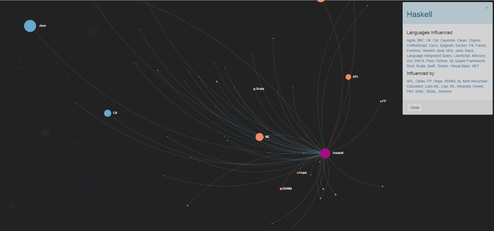

# A Linguagem Haskell
---
## Origens da Linguagem

A linguagem de programação Haskell surgiu em 1990, mas a história das linguagens funcionais (sua definição será vista posteriormente) começou bem antes disso. Tudo isso começa na década de 1930.

* Década de 1930: Alonzo Church cria o Cálculo Lambda. Seu propósito não era para ser usado em computadores, mas sim era mostrar (em forma de modelo matemático) as relações que haviam entre as funções. A partir deste modelo  matemático criado por ele, era possível mostrar que, a partir de funções simples que se relacionavam, era possível criar funções mais complexas, podendo, muito amplamente, modelar comportamentos.

* Década de 1950: é criada a primeira linguagem de programação que continha cálculo Lambda, o LISP. Esta linguagem foi criada por John McCarthy. Foi considerada a segunda linguagem de programação criada no mundo, a primeira foi FORTRAN.  Até hoje sistemas são feitos em Lisp, principalmente para uso em Inteligência Artificial. **Observação:** não era uma linguagem 100% funcional, pois havia elementos da programação imperativa, como a atribuições de variáveis, mudanças de estados, entre outros. 

*  Década de 1960: é criada a primeira linguagem de programação que era puramente funcional, grandemente baseada em cálculo Lambda, a linguagem ISWIN.

* Década de 1970: é desenvolvido a linguagem FP (*Functional Programming*, em português "Programação Funcional"), "uma linguagem de programação
funcional que enfatiza as funções de alto nível" (VEDOVATTO, COSTA, p. 3). Além disso, é criada a linguagem ML, considerada a primeira linguagem de programação funcional moderna, pois criava o conceito de polimorfismo de funções.

* 1978: a grande "alavanca" da programação funcional. John Backus, criador do BNF, publicou um artigo, onde nele ele criticava as linguagens imperativas, pois, segundo ele, as novas gerações de linguagens herdariam falhas de projeto das linguagens antigas e adicionariam novas falhas; estas, por sua vez, seriam herdadas pelas próximas gerações. Assim, essas linguagens apenas cresceriam de tamanho (ou, segundo ele, apenas engordavam), porém, não aumentariam seu poder. Neste artigo, tal argumentação foi demonstrada, e assim exaltando a Programação Funcional.

* Década de 1980:  durante a década de 1980, os pesquisadores da Programação Funcional estavam em um ritmo de pesquisa alto. Resultado destas pesquisas: mais de 12 linguagens funcionais foram criadas neste período, sendo estas as principais: **Miranda**, LML (Lazy (será explicado posteriormente) ML), Orwell, entre outros.

* 1987: em setembro de 1987, foi realizada uma conferência chamada *Functional Programming Languages and Computer Architecture (FPCA 1987)*. O objetivo dela era unificar as linguagens de programação funcionais, criando uma única padrão, seria um padrão aberto para as linguagens.

* 1988: em janeiro, é realizada a primeira reunião do comitê da conferência, onde algumas metas foram discutidas para criar essa linguagem padrão funcional. Alguns dos objetivos para essa nova linguagem:
	- Que fosse viável para o ensino, ou seja, uma linguagem didática; além disso, para a pesquisa e aplicações;
	- Que devesse reduzir a diversidade desnecessária de linguagens funcionais que existiam;
	- Que não fosse proprietária, ou seja, que fosse aberta, a ponto de qualquer um poder implementá-la e distribuí-la;
	- Que se baseasse nas melhores práticas que houvessem nas linguagens funcionais; 
	- Entre outros.  

* 1º de Abril de 1990: é definida,e lançada, a primeira versão do Haskell. Foi criada por Simon Peyton-Jones, Paul Hudak e Philip Walder. O nome da linguagem, Haskell, é em homenagem ao lógico Haskell Curry.  

* 1999: saiu uma versão estável, mínima e portável do Haskell, com o nome de Haskell 98.

Hoje em dia, a versão mais nova estável da linguagem é o Haskell 2010.

"Haskell é a linguagem funcional sobre a qual mais pesquisa
está sendo realizada, nela tem-se a oportunidade de ver como conceitos matemáticos abstratos
se relacionam diretamente com os comandos e estruturas que são construídas." (O'SULLIVAN apud VEDOVATTO, COSTA, p.5)

## A *lazy evaluation* (avaliação preguiçosa)

Um dos conceitos mais importantes da programação funcionais é o conceito de *lazy evaluation*, também conhecida como "avaliação preguiçosa".

Avaliação preguiçosa é uma estratégia de avaliação que "segura" a avaliação de uma expressão até o momento que seja necessário o seu valor, atrasa a computação até seu resultado seja necessário.

É o oposto da avaliação ansiosa, onde neste tipo de avaliação, na primeira vez que encontra a expressão, já é avaliada, e já é visto seu valor.

## Influências do Haskell

Como o Haskell foi uma linguagem que veio com o objetivo de padronizar, devido a grande quantidade de linguagens funcionais que haviam, naturalmente a linguagem receberia influências das linguagens funcionais que já existiam.

Um site, que mostra as influências entre as linguagens de programação mostra que o Haskell foi influenciado principalmente pelo ML, Miranda e Lisp.



Fonte: https://exploringdata.github.io/vis/programming-languages-influence-network-2014/#Haskell

## Classificação do Haskell

**Quanto ao paradigma**: o Haskell é considerado uma linguagem de programação do Paradigma Funcional, ou seja, é uma Linguagem de Programação Funcional. 

### A Programação Funcional

Programação Funcional é um paradigma onde toda a computação é feita a partir de funções matemática, e não há mudança de estado, isto é, ao definir algo com um determinado valor, ele se torna imutável.

Outras características da Programação Funcional:
	
* Os programas possuem apenas funções puras, isto é, são funções que não possuem efeitos colaterais. Efeito colateral seria algo externo que acontecesse na função, como uma entrada de usuário, uma saída para o console, entre outros. Outra forma de entender função pura é o fato de que elas podem ser trocadas pelo seu valor de retorno;

* Cálculo Lambda;

* Entre outros.

---
**Quanto a tipagem**: o Haskell é uma linguagem estática, mas que não é necessário a declaração do tipo, ou seja, pode parecer dinâmica, mas como foi tipo anteriormente, ao definir algo, ele será imutável, logo, implicitamente ele define o tipo.

**Compilada ou Interpretada?** A linguagem Haskell possui um interpretador interativo, similar ao que o Python tem, mas a linguagem Haskell também é compilada. Ou seja, você pode compilar um código Haskell para rodar em forma de EXE, ou interpretá-lo, como um script.

**Quanto ao uso**: "Apesar da citada proximidade com a matemática, a linguagem Haskell é uma linguagem
de propósito geral; portanto, pode-se criar qualquer tipo de programa com ela" (VEDOVATTO, COSTA). Ou seja, pode parecer que seja para o fim específico da Computação Científica, mas não é o foco do Haskell. Ela tem o foco geral que uso em sistemas em geral, além de ser usada no ensino e pesquisa.

## Avaliação da linguagem Haskell, quanto a redigibilidade e legibilidade (writability x readability)

Ao analisarmos este código em Haskell:

```haskell  
module Main where  
  
somaidades :: [Integer] -> Integer  
somaidades lista=(sum lista)*5  
  
main = print (somaidades [21,52,52,34,40,15,60,3])  
```  

Percebe-se que este código pega uma lista com inteiros, que seriam idades de algumas pessoas, usa-o como parâmetro da função somaidades, e retorna a soma das idades, multiplicado por 5. Qual a aplicação dela? Não é o foco deste artigo.

O que se deve focar neste código é o fato de, em apenas 4 linhas de código Haskell, sendo 1 chamando a "main" do código, duas para definir a função somaidades, e uma outra sendo a main em si, onde seria o "núcleo" do programa funcional, a programação toda foi feita. Se formos apenas "contar" as linhas que possuem instruções importantes para o programa, de 4 seriam apenas 2, as linhas 4 e 6. 

O Haskell consegue ser uma linguagem onde "escrevendo pouco se programa muito", digamos assim. Em outras palavras, com poucas linhas de código Haskell é possível programar todo o programa funcional, gerando programas "condensados" no que diz sobre tamanho do código. Isto mostra que a linguagem funcional Haskell tem boa **redigibilidade (writability)**.

Linguagens que possuem boa redigibilidade são linguagens que permitem ao programador programar menos linhas de código, mas no que diz sobre a semântica do programa, ou seja, o que o programa faz, ele tem muito significado, ou que então faz muita computação. O "programa quer dizer o que significa", porém com poucas linhas de código.

Tal diferença de redigibilidade pode ser percebida se compararmos o mesmo problema, mas com um código feito em linguagem imperativa C:

```c
#include <stdio.h>  
int somaidades(int[]);  
int somaidades(int idades[]){  
 	int soma=0;  
   	while(1){  
 		  if((*idades)==NULL)  
 		      	break;  
 		  soma+=*idades;  
 		  idades++;  
      }  
	return soma*5;  
 }  
 int main(){  
	int idades[]={21,52,34,40,15,60,3,NULL};  
	printf("%d",somaidades(idades));  
 }  
```

Um código programado em C para resolver o mesmo problema usou o quádruplo de linhas que foram usadas no Haskell (4 do Haskell contra 16 do C). Se for contar apenas linhas que contenham instruções, tal relação aumenta para um pouco mais que o quádruplo (2 do Haskell contra 9 do C).

Em contrapartida, essa "condensação de código" por parte do Haskell pode gerar uma queda no quesito legibilidade, pois com código menores, mais difícil fica entender qual o propósito do programa. Tal diferença talvez pode não ser vista nestes códigos, pois o problema é um problema menor, mas em casos maiores, a legibilidade fica mais a desejar no caso do Haskell em relação ao C, por exemplo. 

## Avaliação da linguagem Haskell, quanto a expressividade

Quanto ao quesito expressividade, um recurso que pode tornar o Haskell mais expressivo que a linguagem Pascal, por exemplo, é ao fato da linguagem funcional poder usar tuplas em seus programas funcionais. Qual seria a justificativa para se dizer que o Haskell é mais expressivo que o Pascal, dado este recurso que a linguagem funcional tem? A justificativa é a de que este recurso que possui no Haskell não pode ser usado diretamente no Pascal; para se ter tal recurso "artificialmente" na linguagem imperativa, deve-se usar um recurso chamado "record" do Pascal, que simularia o efeito de tuplas do Haskell.

Seja o seguinte problema: existe uma lista de tuplas, onde cada uma delas tem um nome e um número inteiro qualquer. Deseja-se exibir, dentro de uma formatação de tupla, onde cada ocorrência aparecerá em forma de par ordenado, os nomes invertidos, e os números somados dos tamanhos dos nomes. Por exemplo: se uma tupla for ("Carlos",100), com o processamento deve exibir ("solraC",106), e a lista de tupla é exibida entre colchetes( [] ).

A seguir é visto o código do problema em Haskell:

```haskell  
module Main where  
   
manipulartupla :: ([Char], Int) -> ([Char], Int)  
manipulartupla (a,b)=(reverse(a),b+length a)  

r=[("Rafael",250),("Joao",40),("Maria",79),("Camilo",126)]  
 
main=print (map manipulartupla r)  
```

Observação: as linhas 3 do código em haskell desta seção e do código em haskell da seção anterior tem a função de descrever uma função em haskell, o nome, o tipo de entrada e o tipo de saída.

Percebe-se pelo código acima que, com o recurso de tupla, com a função reverse que a linguagem tem, e com a função map que a mesma tem também, o programa resolve o problema com apenas 5 linhas, sendo 3 com funções propriamente ditas. A função reverse, pelo o que o nome diz, tem o objetivo de colocar uma string ao contrário. Já a função map captura todos os elementos da lista, e os executa na função dita posteriormente no código, a função "manipulartupla".

Tais recursos ditos acima não existem na linguagem Pascal. E então: como resolver o mesmo problema em Pascal? Será preciso fazer algumas adaptações para poder codificar o problema em Pascal.

* Para o detalhe do uso de tuplas no Pascal, pode-se obter artificialmente por meio de "record", que é um tipo de dado do Pascal onde pode agrupar dados de tipos diferentes, como o deste caso, que tem uma string e um inteiro.

* Para o caso do reverse, que é para colocar uma string ao contrário, não existe tal função em Pascal. Com isso, deve-se implementar uma função que tenha o objetivo de colocar uma string ao contrário.

* E por último, no que diz sobre a função map, o que tem efeito similar a ele no Pascal seria o uso de "for", para varrer por cada elemento do vetor de tuplas, e executar o que deve ser executado.

Observação: a linguagem Pascal não possui recurso de vetor dinâmico, logo, os vetores possuem tamanho fixo, uma quantidade máxima de elementos, diferentemente do Haskell que as listas são dinâmicas, podem variar a quantidade de elementos contidos nele.

O código em Pascal para resolver o problema:

```pascal  
Program expressividade ;  
type   
	tupla= record  
		nome: string[10];  
		num: integer;  
	end;  
var tup: array[1..4] of tupla;  
i:integer;  
function reverso(texto:string):string;  
    var saida:string;  
    tam,i:integer;  
    begin  
    tam:=length(texto)+1;  
    for i:=1 to tam do  
    saida:=saida+texto[tam-i+1];  
    reverso:=saida;  
    end;  
 Begin  
 	tup[1].nome:='Rafael';  
 	tup[1].num:=250;  
 	tup[2].nome:='Joao';  
 	tup[2].num:=40;  
 	tup[3].nome:='Maria';  
	tup[3].num:=79;  
 	tup[4].nome:='Camilo';  
 	tup[4].num:=126;  
	write('[');  
     for i :=1 to 4 do  
	begin  
		write('("',reverso(tup[i].nome),'",',tup[i].num+length(tup[i].nome),')');  
		if i<>4 then  
			write(',');  
	end;  
	write(']');  
 End.  
```

## Conclusão

A linguagem Haskell veio com o objetivo de "unificar' todas as linguagens funcionais que existiam até suas criação. Isto facilitou as pesquisas da área, pois ele conseguiu colocar vários recursos que haviam entre as linguagens de programação funcionais em uma só.

Por sua boa redigibilidade, seus códigos são, quase sempre, condensados, pequenos, mas que, muitas vezes, pode pecar em sua legibilidade, gerando um pouco de dificuldade de entender o que o programa faz.

A Haskell mostra que um problema pode ser visto como uma sequência de execução de funções matemáticas simples, que, uma após a outra, passando o resultado de uma função passa a próxima, pode-se chegar ao resultado esperado, ou seja, um problema pode ser dividido em pequenas funções simples para que se possa chegar ao resultado desejado.


## Bibliografia

* (PARRELA, M.) Haskell Básico - A História: https://marceloparrela.wordpress.com/2013/11/01/haskell-a-historia/

* Haskell (Linguagem de Programação) - Wikipédia, a enciclopédia livre: https://pt.wikipedia.org/wiki/Haskell_(linguagem_de_programa%C3%A7%C3%A3o)

* (BOSCAGLIA, B. S., SATLER, P. S., MATOS, R. P.) Haskell: http://www.inf.ufes.br/~vitorsouza/wp-content/uploads/teaching-lp-20132-seminario-haskell.pdf

* Avaliação Preguiçosa - Unionpédia, o mapa conceitual: http://pt.unionpedia.org/Avalia%C3%A7%C3%A3o_pregui%C3%A7osa

* Programação funcional avaliação preguiçosa: http://www.w3ii.com/pt/functional_programming/functional_programming_lazy_evaluation.html

* (CARNEIRO, T.) Linguagem Haskell: http://www.ppgsc.ufrn.br/~rogerio/material_auxiliar/CLP20132_introducao_haskell.pdf

* Programação Funcional I: Imutabilidade e Funções Puras (Scala):https://codingcreeper.wordpress.com/2013/11/19/programacao-funcional-1-imutabilidade-e-funcoes-puras/

* Haskell em 10 minutos - HaskellWiki: https://wiki.haskell.org/Haskell_em_10_minutos

* (LIMA, M. A. V.) Introdução a Programação ao Funcional - Linguagem Haskell: http://www.facom.ufu.br/~madriana/PF/hs.pdf

* HaskellWiki: https://wiki.haskell.org/Haskell

* (VEDOVATTO, T., COSTA, E. T.) Haskell: uma linguagem de programação ideal para matemáticos: http://matematicajatai.com/rematFiles/3-2013/haskell.pdf

* Aprender Haskell será um grande bem para você!: http://haskell.tailorfontela.com.br/

